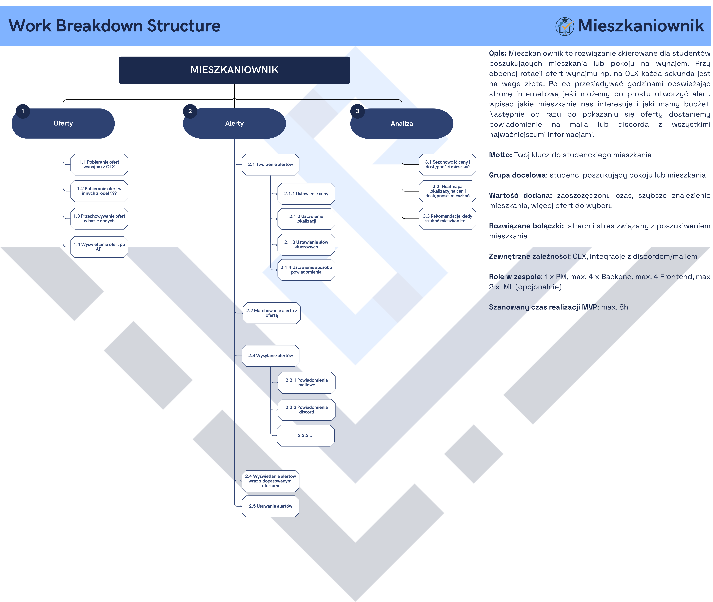
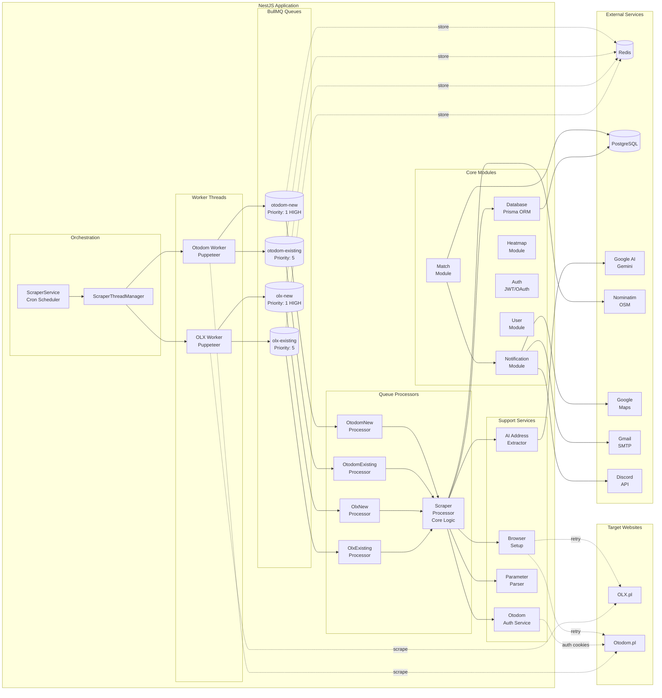
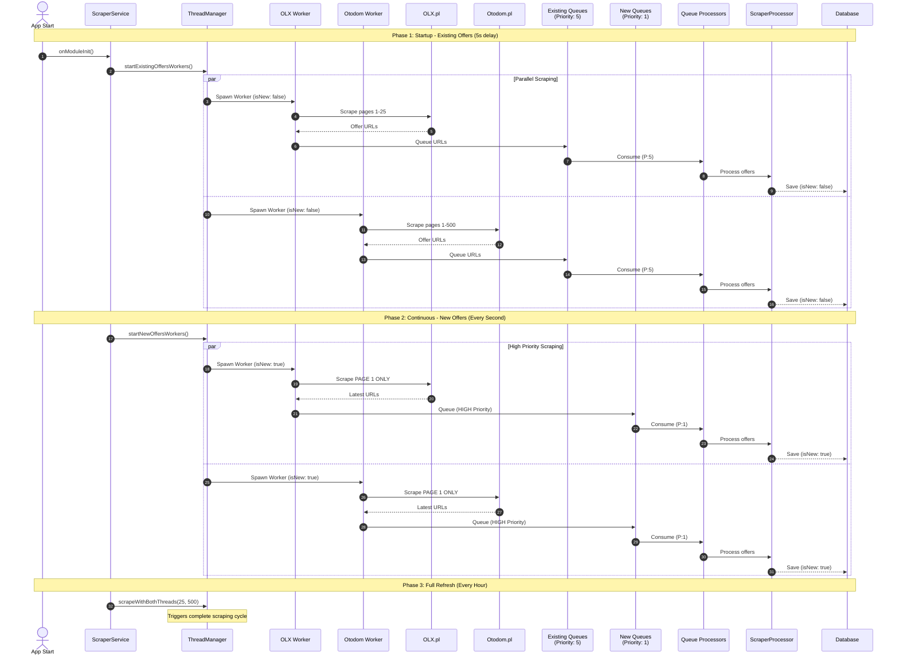
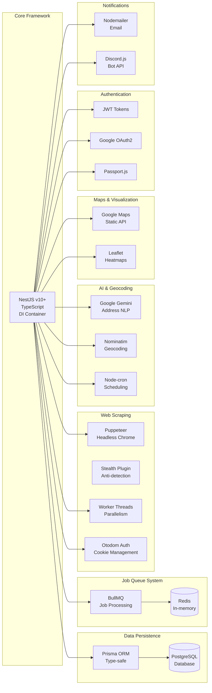
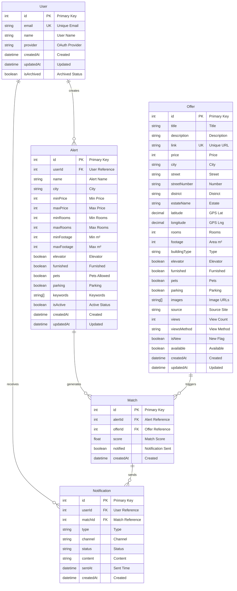
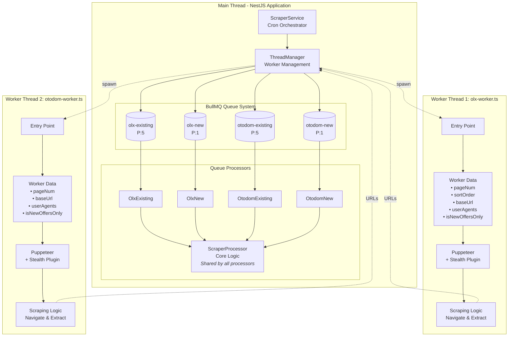
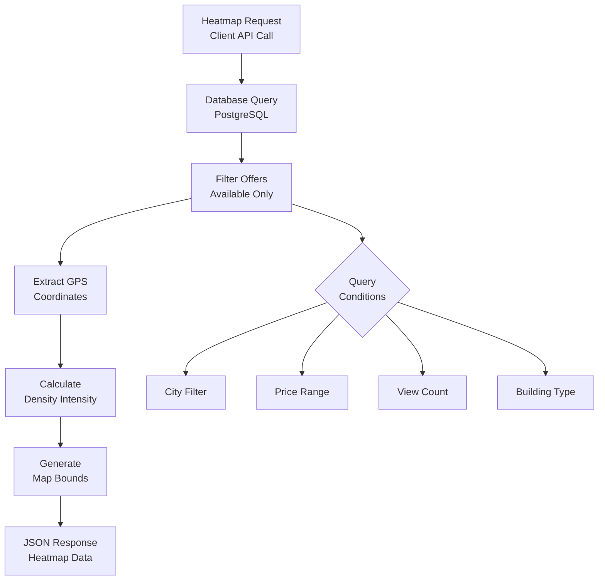
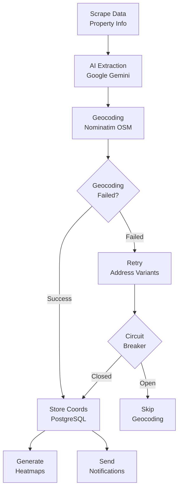

# Mieszkaniownik Architecture

## System Overview

## Multi-Threading Architecture Details

## Technology Stack & Frameworks

## Database Schema & Data Flow

## Scraping Algorithm Flow

```mermaid
flowchart TB
    START([App Start<br/>+5s delay])
    START --> INIT[Init Service<br/>startExistingWorkers]
    INIT --> SPAWN_EXIST[Spawn 2 Threads]

    SPAWN_EXIST --> SPLIT_EXIST{ }
    SPLIT_EXIST --> OLX_EXIST[OLX Worker<br/>isNew: false]
    SPLIT_EXIST --> OTDM_EXIST[Otodom Worker<br/>isNew: false]

    OLX_EXIST --> OLX_SCRAPE[Scrape 25 pages<br/>Extract URLs]
    OTDM_EXIST --> OTDM_SCRAPE[Scrape 500 pages<br/>Extract URLs]

    OLX_SCRAPE --> OLX_Q[olx-existing<br/>P:5]
    OTDM_SCRAPE --> OTDM_Q[otodom-existing<br/>P:5]

    OLX_Q --> OLX_PROC[OlxExistingProc]
    OTDM_Q --> OTDM_PROC[OtodomExistingProc]

    OLX_PROC --> MERGE_EXIST{ }
    OTDM_PROC --> MERGE_EXIST

    MERGE_EXIST --> CRON_SEC([Every Second<br/>Cron Job])
    CRON_SEC --> NEW_INIT[Start New Workers]
    NEW_INIT --> SPAWN_NEW[Spawn 2 Threads]

    SPAWN_NEW --> SPLIT_NEW{ }
    SPLIT_NEW --> OLX_NEW[OLX Worker<br/>isNew: true]
    SPLIT_NEW --> OTDM_NEW[Otodom Worker<br/>isNew: true]

    OLX_NEW --> OLX_NEW_SCRAPE[Scrape PAGE 1<br/>Latest URLs]
    OTDM_NEW --> OTDM_NEW_SCRAPE[Scrape PAGE 1<br/>Latest URLs]

    OLX_NEW_SCRAPE --> OLX_NEW_Q[olx-new<br/>P:1 HIGH]
    OTDM_NEW_SCRAPE --> OTDM_NEW_Q[otodom-new<br/>P:1 HIGH]

    OLX_NEW_Q --> OLX_NEW_PROC[OlxNewProc]
    OTDM_NEW_Q --> OTDM_NEW_PROC[OtodomNewProc]

    OLX_NEW_PROC --> MERGE_NEW{ }
    OTDM_NEW_PROC --> MERGE_NEW

    MERGE_NEW --> MAIN_PROC[ScraperProcessor<br/>Main Logic]

    MAIN_PROC --> BROWSER[Browser Setup<br/>Puppeteer]
    BROWSER --> AUTH{Otodom?}
    AUTH -->|Yes| OTODOM_AUTH[Apply Auth<br/>Cookies]
    AUTH -->|No| PARSE
    OTODOM_AUTH --> PARSE[Parse Parameters<br/>Extract Data]
    PARSE --> AI[AI Extraction<br/>Google Gemini]
    AI --> GEO[Geocoding<br/>Nominatim OSM]
    GEO --> SAVE[Save to DB<br/>PostgreSQL]
    SAVE --> MATCH[Match Check<br/>Score Calculation]
    MATCH --> DECISION{Match Found?}

    DECISION -->|Yes| NOTIFY[Send Notification<br/>Email + Discord]
    DECISION -->|No| END[Job Complete]
    NOTIFY --> END

    CRON_HOUR([Every Hour<br/>Full Refresh])
    CRON_HOUR --> FULL[Full Scrape<br/>scrapeWithBothThreads]
    FULL --> SPAWN_EXIST
    END --> CRON_SEC
```

## Worker Thread Implementation Details

## Heatmap Service Architecture

### Database Flow

### Geocoding Pipeline

