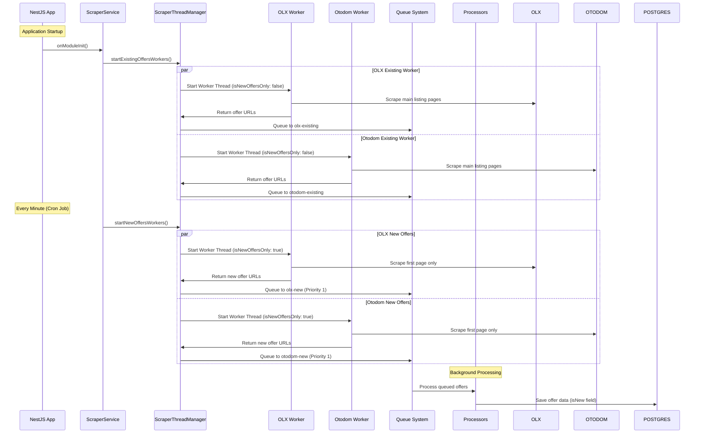
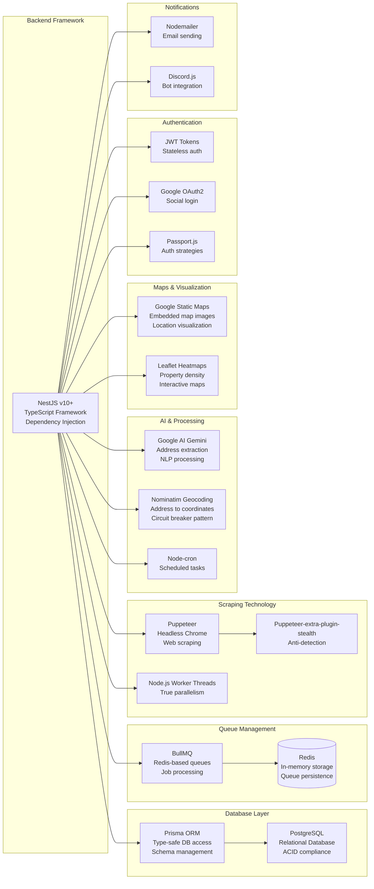
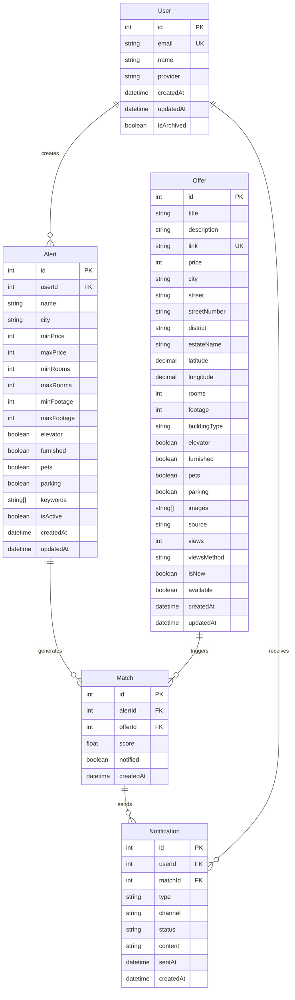
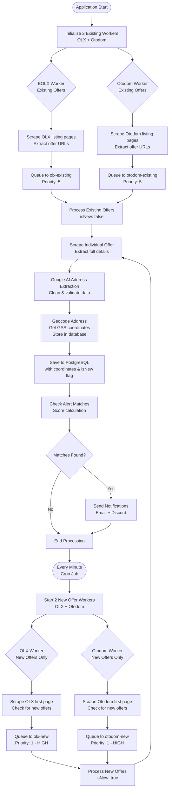
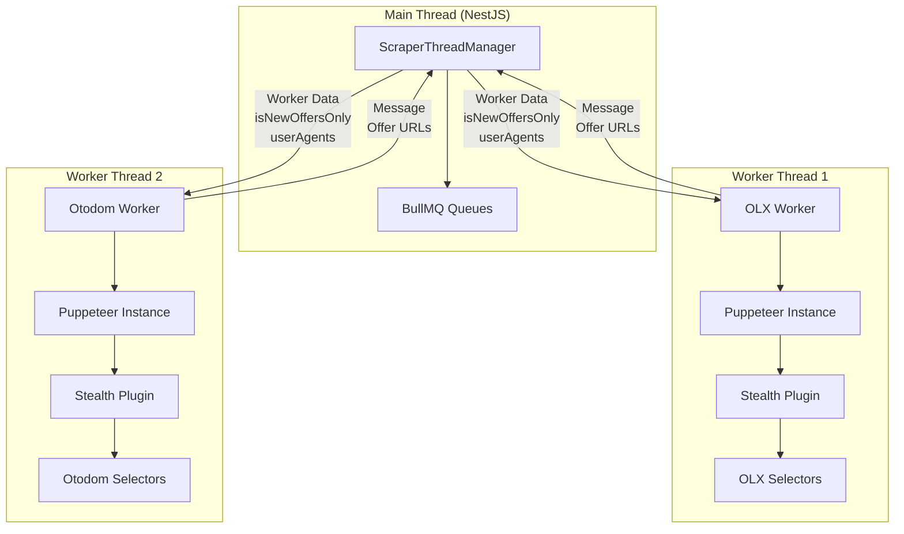
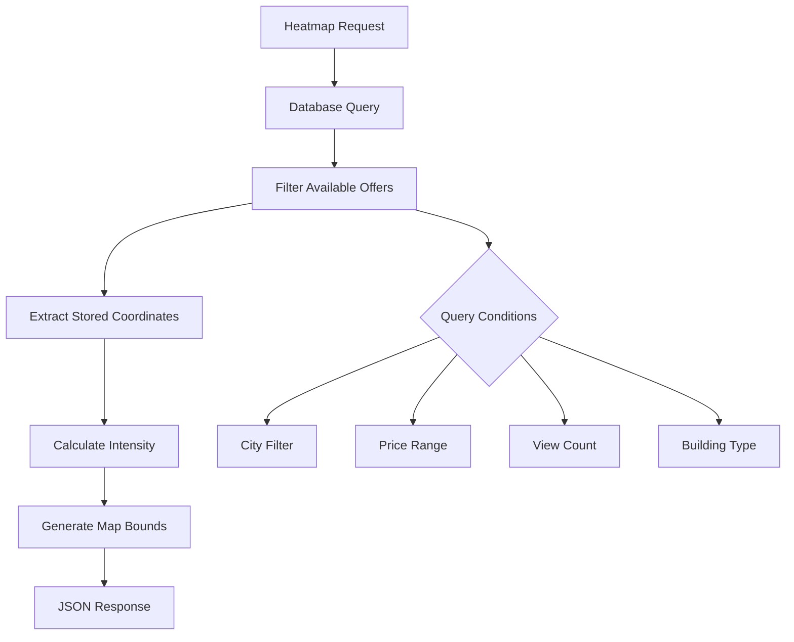
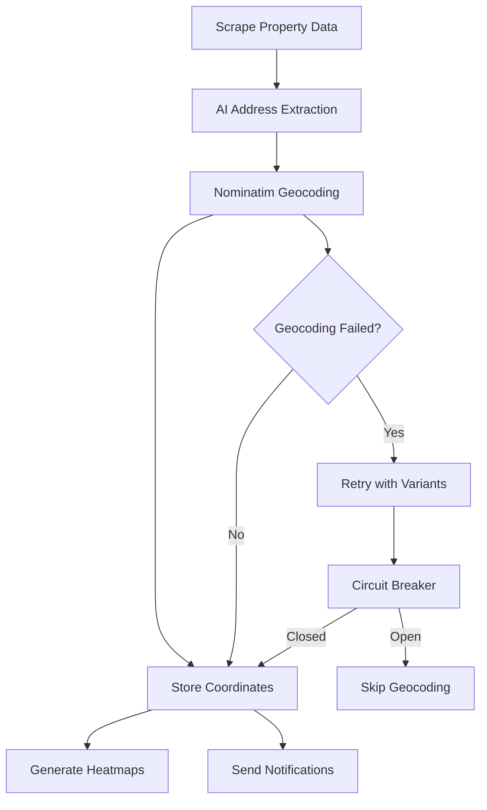

# Mieszkaniownik Architecture

## System Overview

```mermaid
graph TB
    subgraph "NestJS Application"
        subgraph "Core Modules"
            AM[AuthModule<br/>JWT + Google OAuth]
            UM[UserModule<br/>User Management]
            DM[DatabaseModule<br/>Prisma ORM]
            NM[NotificationModule<br/>Email + Discord]
            MM[MatchModule<br/>Alert Matching]
            HM[HeatmapModule<br/>Data Visualization]
        end

        subgraph "Scraper Module - Multi-Threading Architecture"
            SS[ScraperService<br/>Main Orchestrator]
            STM[ScraperThreadManager<br/>Worker Management]
            SP[ScraperProcessor<br/>Job Processing]

            subgraph "Dedicated Processors"
                OEP[OlxExistingProcessor]
                OTEP[OtodomExistingProcessor]
                ONP[OlxNewProcessor]
                OTNP[OtodomNewProcessor]
            end

            subgraph "Worker Threads"
                EOW[OLX Worker<br/>JavaScript Worker Thread]
                EOTW[Otodom Worker<br/>JavaScript Worker Thread]
            end

            subgraph "Queue System"
                SQ[scraper queue<br/>Main processing]
                OEQ[olx-existing queue<br/>Existing offers]
                OTEQ[otodom-existing queue<br/>Existing offers]
                ONQ[olx-new queue<br/>New offers - Priority 1]
                OTNQ[otodom-new queue<br/>New offers - Priority 1]
            end
        end
    end

    subgraph "External Services"
        REDIS[(Redis<br/>Queue Storage)]
        POSTGRES[(PostgreSQL<br/>Database)]
        GOOGLE[Google AI<br/>Address Extraction]
        NOMINATIM[Nominatim OSM<br/>Geocoding Service]
        GMAPS[Google Static Maps<br/>Map Images]
        EMAIL[Gmail SMTP<br/>Notifications]
        DISCORD[Discord API<br/>Notifications]
    end

    subgraph "Target Websites"
        OLX[OLX.pl<br/>Property Listings]
        OTODOM[Otodom.pl<br/>Property Listings]
    end

    %% Core connections
    SS --> STM
    STM --> EOW
    STM --> EOTW
    SS --> SP

    %% Queue connections
    STM --> OEQ
    STM --> OTEQ
    STM --> ONQ
    STM --> OTNQ

    OEP --> SQ
    OTEP --> SQ
    ONP --> SQ
    OTNP --> SQ

    %% External connections
    DM --> POSTGRES
    SQ --> REDIS
    OEQ --> REDIS
    OTEQ --> REDIS
    ONQ --> REDIS
    OTNQ --> REDIS

    EOW --> OLX
    EOTW --> OTODOM

    SP --> GOOGLE
    SP --> NOMINATIM
    NM --> EMAIL
    NM --> DISCORD
    NM --> GMAPS
```

## Multi-Threading Architecture Details

## Technology Stack & Frameworks

## Database Schema & Data Flow

## Scraping Algorithm Flow

## Worker Thread Implementation Details

## Heatmap Service Architecture

The heatmap service provides real-time property density visualization using pre-stored GPS coordinates.

### Database-Driven Approach

### Geocoding Pipeline

